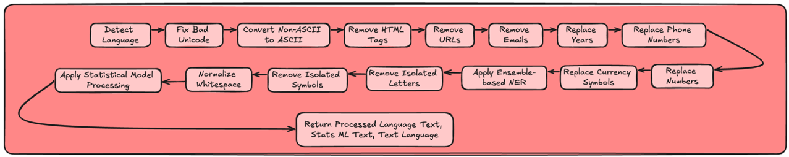

# `SqueakyCleanText` 

[](https://pypi.org/project/squeakycleantext/) [](https://pypistats.org/packages/squeakycleantext)

In the world of machine learning and natural language processing, clean and well-structured text data is crucial for building effective downstream models and managing token limits in language models. 

SqueakyCleanText simplifies the process by automatically addressing common text issues, ensuring your data is clean and well-structured with minimal effort on your part.

### Key Features
- **Encoding Issues**: Corrects text encoding problems and handles bad Unicode characters.
- **HTML and URLs**: Removes or replaces HTML tags and URLs with configurable tokens.
- **Contact Information**: Handles emails, phone numbers, and other contact details with customizable replacement tokens.
- **Named Entity Recognition (NER)**:
  - Multi-language support (English, Dutch, German, Spanish)
  - Ensemble voting technique for improved accuracy
  - Configurable confidence thresholds
  - Efficient batch processing
  - Automatic text chunking for long documents
  - GPU acceleration support
- **Text Normalization**:
  - Removes isolated letters and symbols
  - Normalizes whitespace
  - Handles currency symbols
  - Year detection and replacement
  - Number standardization
- **Language Support**:
  - Automatic language detection
  - Language-specific NER models
  - Language-aware stopword removal
- **Dual Output Formats**:
  - Language Model format (preserves structure with tokens)
  - Statistical Model format (optimized for classical ML)
- **Performance Optimization**:
  - Batch processing support
  - Configurable batch sizes
  - Memory-efficient processing of large texts
  - GPU memory management



### Benefits

#### For Language Models
- Maintains text structure while anonymizing sensitive information
- Configurable token replacements
- Preserves context while removing noise
- Handles long documents through intelligent chunking

#### For Statistical Models
- Removes stopwords and punctuation
- Case normalization
- Special symbol removal
- Optimized for classification tasks

#### Advanced NER Processing
- Ensemble approach reduces missed entities
- Language-specific models improve accuracy
- Confidence thresholds for precision control
- Efficient batch processing for large datasets
- Automatic handling of long documents

## Installation

```sh
pip install SqueakyCleanText
```

## Usage

### Basic Usage
```python
from sct import sct

# Initialize the TextCleaner
sx = sct.TextCleaner()

# Process single text
text = "Hey John Doe, email me at john.doe@example.com"
lm_text, stat_text, language = sx.process(text)

# Process multiple texts efficiently
texts = ["Text 1", "Text 2", "Text 3"]
results = sx.process_batch(texts, batch_size=2)
```

### Advanced Configuration
```python
from sct import sct, config

# Customize NER settings
config.CHECK_NER_PROCESS = True
config.NER_CONFIDENCE_THRESHOLD = 0.85
config.POSITIONAL_TAGS = ['PER', 'LOC', 'ORG']

# Customize replacement tokens
config.REPLACE_WITH_URL = "<URL>"
config.REPLACE_WITH_EMAIL = "<EMAIL>"
config.REPLACE_WITH_PHONE_NUMBERS = "<PHONE>"

# Set known language (skips detection)
config.LANGUAGE = "ENGLISH"  # Options: ENGLISH, DUTCH, GERMAN, SPANISH

# Initialize with custom settings
sx = sct.TextCleaner()
```

## API

### `sct.TextCleaner`

#### `process(text: str) -> Tuple[str, str, str]`

Processes the input text and returns a tuple containing:
    - Cleaned text formatted for language models.
    - Cleaned text formatted for statistical models (stopwords removed).
    - Detected language of the text.

## Contributing

Contributions are welcome! Please feel free to submit a Pull Request or open an issue.

## License

This project is licensed under the MIT License - see the [LICENSE](LICENSE) file for details.

## Acknowledgements

The package took inspirations from the following repo:

- [clean-text](https://github.com/jfilter/clean-text)
