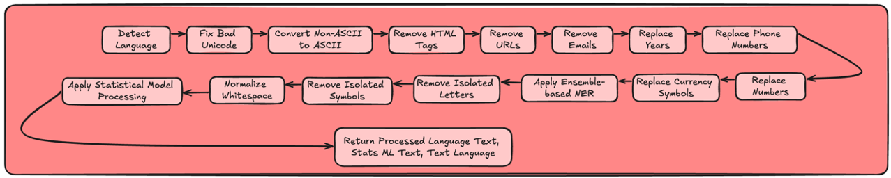

<div align="center">

# SqueakyCleanText

[](https://pypi.org/project/squeakycleantext/)
[](https://pypistats.org/packages/squeakycleantext)
[](https://github.com/rhnfzl/SqueakyCleanText/actions/workflows/python-package.yml)
[](https://pypi.org/project/squeakycleantext/)
[](LICENSE)

A comprehensive text cleaning and preprocessing pipeline for machine learning and NLP tasks.
</div>

> **Using an AI coding assistant?** This repo includes an [`llms.txt`](https://github.com/rhnfzl/SqueakyCleanText/blob/main/llms.txt) with the full API surface, config reference, and Q&A - optimised for Claude, Cursor, Copilot, and ChatGPT.

In the world of machine learning and natural language processing, clean and well-structured text data is crucial for building effective downstream models and managing token limits in language models.

SqueakyCleanText simplifies the process by automatically addressing common text issues - removing PII, anonymizing named entities (persons, organisations, locations), and ensuring your data is clean and well-structured for language models and classical ML pipelines with minimal effort on your part.

### Key Features

- **Named Entity Recognition (NER)**:
  - Multi-backend: ONNX (default, torch-free), PyTorch, GLiNER, and ensemble modes
  - Zero-shot custom entities via GLiNER (e.g., PRODUCT, EVENT, SKILL)
  - Multi-language support (English, Dutch, German, Spanish, French, Portuguese, Italian)
  - Ensemble voting across backends for improved accuracy
  - Configurable confidence thresholds
  - Lazy model loading (models load on demand per language)
  - Shared ONNX sessions across same-model languages (~600 MB RAM saved)
  - Automatic text chunking for long documents (CJK/Arabic safe)
  - GPU acceleration support (CUDA for ONNX and PyTorch)
  - Model warm-up API to pre-load on startup
- **Text Normalization**:
  - Corrects text encoding problems and handles bad Unicode characters
  - Removes or replaces HTML tags and URLs with configurable tokens
  - Handles emails, phone numbers, and other contact details
  - Multilingual date detection and replacement (ISO 8601, month names, common formats)
  - Fuzzy date matching for misspelled months (requires `[fuzzy]` extra)
  - Year and number standardization
  - Configurable emoji removal
  - Configurable bracket/brace content removal
  - Removes isolated letters and symbols
  - Normalizes whitespace and handles currency symbols
  - Smart case folding (preserves NER tokens like `<PERSON>`)
- **Language Support**:
  - Automatic language detection (English, Dutch, German, Spanish)
  - Language-specific NER models; French, Portuguese, Italian via multilingual model
  - Language-aware stopword removal
  - Extensible: add custom languages with stopwords, month names, and NER models
- **Dual Output Formats**:
  - Language Model format (preserves structure with tokens)
  - Statistical Model format (optimized for classical ML)
- **Performance**:
  - ONNX Runtime inference (torch-free base install, ~3-5x faster than PyTorch)
  - Thread-parallel batch processing via `ThreadPoolExecutor`
  - Async batch processing (`aprocess_batch`) for FastAPI / aiohttp
  - Lazy model loading (only loads models as needed)
  - Shared ONNX sessions for same-model languages (saves ~600 MB for FR/PT/IT)
  - Memory-efficient processing of large texts
  - GPU acceleration (CUDA) for both ONNX and PyTorch backends



### Benefits

#### For Language Models
- Maintains text structure while anonymizing sensitive information
- Configurable token replacements
- Preserves context while removing noise
- Handles long documents through intelligent chunking

#### For Statistical Models
- Removes stopwords and punctuation
- Case normalization
- Special symbol removal
- Optimized for classification tasks

#### Advanced NER Processing
- Ensemble approach reduces missed entities
- Language-specific models improve accuracy
- Confidence thresholds for precision control
- Efficient batch processing for large datasets
- Automatic handling of long documents

## Installation

```sh
pip install SqueakyCleanText
```

The base install uses **ONNX Runtime** for NER inference - no PyTorch or Transformers required.

### Optional Extras

| Extra | Command | What it adds |
|-------|---------|--------------|
| GPU | `pip install SqueakyCleanText[gpu]` | CUDA-accelerated ONNX inference |
| Fuzzy dates | `pip install SqueakyCleanText[fuzzy]` | Fuzzy month name matching ([rapidfuzz](https://github.com/rapidfuzz/RapidFuzz)) |
| PyTorch NER | `pip install SqueakyCleanText[torch]` | PyTorch/Transformers NER backend |
| GLiNER | `pip install SqueakyCleanText[gliner]` | [GLiNER](https://github.com/urchade/GLiNER) zero-shot NER |
| GLiNER2 | `pip install SqueakyCleanText[gliner2]` | [GLiNER2](https://github.com/Knowledgator/GLiNER) (knowledgator) backend |
| All NER | `pip install SqueakyCleanText[all-ner]` | All NER backends combined |
| Development | `pip install SqueakyCleanText[dev]` | Testing and linting tools |

You can combine extras: `pip install SqueakyCleanText[gpu,fuzzy,gliner]`

## Usage

### Basic Usage

```python
from sct import TextCleaner

# Initialize the TextCleaner
cleaner = TextCleaner()

# Input text
text = "Contact John Doe at john.doe@company.com. Meeting on 2023-10-01."

# Process the text
lm_text, stat_text, lang = cleaner.process(text)

print(f"Language Model format:    {lm_text}")
# Output: "Contact <PERSON> at <EMAIL>. Meeting on <YEAR>."

print(f"Statistical Model format: {stat_text}")
# Output: "contact meeting"

print(f"Detected Language: {lang}")
# Output: "ENGLISH"
```

### Using TextCleanerConfig

```python
from sct import TextCleaner, TextCleanerConfig

# Create an immutable configuration
cfg = TextCleanerConfig(
    check_ner_process=True,
    ner_confidence_threshold=0.85,
    positional_tags=('PER', 'LOC', 'ORG', 'MISC'),
    replace_with_url="<URL>",
    replace_with_email="<EMAIL>",
    replace_with_phone_numbers="<PHONE>",
    language="ENGLISH",  # Skip auto-detection
)

# Initialize with config
cleaner = TextCleaner(cfg=cfg)
```

### GLiNER: Zero-Shot Custom NER

Use [GLiNER](https://github.com/urchade/GLiNER) to recognize any entity type without retraining:

```python
from sct import TextCleaner, TextCleanerConfig

cfg = TextCleanerConfig(
    ner_backend='gliner',
    gliner_model='urchade/gliner_large-v2.1',
    gliner_labels=('person', 'organization', 'location', 'product', 'event'),
    gliner_label_map={
        'person': 'PER', 'organization': 'ORG', 'location': 'LOC',
        # 'product' and 'event' are unmapped - they become <PRODUCT>, <EVENT> tokens
    },
    gliner_threshold=0.4,
)

cleaner = TextCleaner(cfg=cfg)
lm_text, stat_text, lang = cleaner.process(
    "John bought an iPhone at the Apple Store in Berlin during CES 2025."
)
# lm_text: "<PERSON> bought an <PRODUCT> at the <ORGANISATION> in <LOCATION> during <EVENT>."
```

### Ensemble NER

Combine ONNX/Torch models with GLiNER for improved recall via ensemble voting:

```python
from sct import TextCleaner, TextCleanerConfig

cfg = TextCleanerConfig(
    ner_backend='ensemble_onnx',  # or 'ensemble_torch'
    gliner_model='urchade/gliner_large-v2.1',
    gliner_labels=('person', 'organization', 'location'),
    gliner_label_map={'person': 'PER', 'organization': 'ORG', 'location': 'LOC'},
)

cleaner = TextCleaner(cfg=cfg)
lm_text, stat_text, lang = cleaner.process("Angela Merkel visited the Bundestag in Berlin.")
```

### Batch Processing

```python
from sct import TextCleaner, TextCleanerConfig

cfg = TextCleanerConfig(
    check_remove_stopwords=True,
    check_remove_punctuation=True,
    check_ner_process=True,
    positional_tags=('PER', 'ORG', 'LOC'),
    ner_confidence_threshold=0.90,
)

cleaner = TextCleaner(cfg=cfg)

# Sample texts
texts = [
    "Email maria.garcia@example.es for more info.",  # Spanish
    "Besuchen Sie uns im Büro in Berlin.",           # German
    "Voor vragen, bel +31 20 123 4567.",             # Dutch
]

# Process texts in batch (uses ThreadPoolExecutor for parallel processing)
results = cleaner.process_batch(texts, batch_size=2)

for lm_text, stat_text, lang in results:
    print(f"Language: {lang}")
    print(f"LM Format:    {lm_text}")
    print(f"Stat Format:  {stat_text}")
    print("-" * 40)
```

<details>
<summary>Legacy Configuration (backward compatible)</summary>

```python
from sct import sct, config

# Customize settings via module-level variables
config.CHECK_NER_PROCESS = True
config.NER_CONFIDENCE_THRESHOLD = 0.85
config.POSITIONAL_TAGS = ['PER', 'LOC', 'ORG']
config.REPLACE_WITH_URL = "<URL>"
config.REPLACE_WITH_EMAIL = "<EMAIL>"
config.LANGUAGE = "ENGLISH"

# Initialize (reads from module-level config)
cleaner = sct.TextCleaner()
```

> **Note**: The legacy module-level configuration is not thread-safe. For concurrent processing, use `TextCleanerConfig` instead.

</details>

## NER Backends

SqueakyCleanText supports five NER backends, selectable via the `ner_backend` config field:

| Backend | Description | Dependencies | Best for |
|---------|-------------|-------------|----------|
| `onnx` (default) | ONNX Runtime inference with quantized XLM-RoBERTa models | Base install | Production: fast, torch-free |
| `torch` | PyTorch/Transformers pipeline with full XLM-RoBERTa models | `[torch]` extra | Compatibility with existing PyTorch workflows |
| `gliner` | GLiNER zero-shot NER with custom entity labels | `[gliner]` or `[gliner2]` extra | Custom entity types (PRODUCT, SKILL, EVENT, etc.) |
| `ensemble_onnx` | ONNX + GLiNER ensemble voting | `[gliner]` extra | Maximum recall with custom entities |
| `ensemble_torch` | Torch + GLiNER ensemble voting | `[torch,gliner]` extra | Maximum recall with PyTorch |

### Default NER Models (ONNX)

| Language | Model |
|----------|-------|
| English | [`rhnfzl/xlm-roberta-large-conll03-english-onnx`](https://huggingface.co/rhnfzl/xlm-roberta-large-conll03-english-onnx) |
| Dutch | [`rhnfzl/xlm-roberta-large-conll02-dutch-onnx`](https://huggingface.co/rhnfzl/xlm-roberta-large-conll02-dutch-onnx) |
| German | [`rhnfzl/xlm-roberta-large-conll03-german-onnx`](https://huggingface.co/rhnfzl/xlm-roberta-large-conll03-german-onnx) |
| Spanish | [`rhnfzl/xlm-roberta-large-conll02-spanish-onnx`](https://huggingface.co/rhnfzl/xlm-roberta-large-conll02-spanish-onnx) |
| French / Portuguese / Italian | [`rhnfzl/wikineural-multilingual-ner-onnx`](https://huggingface.co/rhnfzl/wikineural-multilingual-ner-onnx) (shared session) |
| Multilingual (fallback) | [`rhnfzl/wikineural-multilingual-ner-onnx`](https://huggingface.co/rhnfzl/wikineural-multilingual-ner-onnx) |

### GLiNER Label Mapping

GLiNER uses lowercase free-text labels (e.g., `'person'`, `'product'`). To map them to standard NER tags used by the anonymizer, use `gliner_label_map`:

```python
gliner_label_map={
    'person': 'PER',          # → <PERSON>
    'organization': 'ORG',    # → <ORGANISATION>
    'location': 'LOC',        # → <LOCATION>
}
# Unmapped labels are uppercased automatically:
# 'product' → <PRODUCT>, 'event' → <EVENT>, 'skill' → <SKILL>
```

## API

### `TextCleaner`

#### `process(text: str) -> Tuple[str, Optional[str], Optional[str]]`

Processes the input text and returns a tuple containing:
  - Cleaned text formatted for language models.
  - Cleaned text formatted for statistical models (`None` if `check_statistical_model_processing` is `False`).
  - Detected language of the text (`None` if language detection is disabled).

#### `process_batch(texts: List[str], batch_size: int = None) -> List[Tuple[str, Optional[str], Optional[str]]]`

Processes multiple texts using thread-parallel execution. Each result follows the same format as `process()`.

#### `aprocess_batch(texts: List[str], batch_size: int = None) -> List[Tuple[str, Optional[str], Optional[str]]]`

Async version of `process_batch` for use with asyncio-based frameworks (FastAPI, aiohttp). Runs the batch in a thread-pool executor so it does not block the event loop:

```python
from sct import TextCleaner

cleaner = TextCleaner()

# In an async context (FastAPI route, aiohttp handler, etc.)
results = await cleaner.aprocess_batch(texts)
```

#### `warmup(languages: Optional[List[str]] = None) -> None`

Pre-loads NER models to avoid first-request latency. Call once during application startup:

```python
cleaner = TextCleaner()
cleaner.warmup(['ENGLISH', 'DUTCH'])  # or warmup() for all supported languages
```

### `TextCleanerConfig`

Immutable (frozen) dataclass. Create modified copies with `dataclasses.replace()`:

```python
import dataclasses
new_cfg = dataclasses.replace(cfg, check_ner_process=False)
```

<details>
<summary>Full configuration reference</summary>

**Pipeline toggles** (all `bool`, default shown):

| Field | Default | Description |
|-------|---------|-------------|
| `check_detect_language` | `True` | Auto-detect language |
| `check_fix_bad_unicode` | `True` | Fix encoding issues via ftfy |
| `check_to_ascii_unicode` | `True` | Transliterate to ASCII |
| `check_replace_html` | `True` | Strip/replace HTML tags |
| `check_replace_urls` | `True` | Replace URLs with token |
| `check_replace_emails` | `True` | Replace emails with token |
| `check_replace_years` | `True` | Replace years (1900-2099) |
| `check_replace_dates` | `False` | Replace full dates (ISO 8601, month names) |
| `check_fuzzy_replace_dates` | `False` | Fuzzy match misspelled months (requires `[fuzzy]`) |
| `check_replace_phone_numbers` | `True` | Replace phone numbers |
| `check_replace_numbers` | `True` | Replace standalone numbers |
| `check_replace_currency_symbols` | `True` | Replace currency symbols |
| `check_ner_process` | `True` | Run NER entity recognition |
| `check_remove_isolated_letters` | `True` | Remove single letters |
| `check_remove_isolated_special_symbols` | `True` | Remove isolated symbols |
| `check_remove_bracket_content` | `True` | Remove `[...]` content |
| `check_remove_brace_content` | `True` | Remove `{...}` content |
| `check_normalize_whitespace` | `True` | Normalize whitespace |
| `check_statistical_model_processing` | `True` | Generate stat model output |
| `check_casefold` | `True` | Lowercase stat output |
| `check_smart_casefold` | `False` | Lowercase but preserve NER tokens |
| `check_remove_stopwords` | `True` | Remove stopwords from stat output |
| `check_remove_punctuation` | `True` | Remove punctuation from stat output |
| `check_remove_stext_custom_stop_words` | `True` | Remove custom stop words from stat output |
| `check_remove_emoji` | `False` | Remove emoji characters |

**Replacement tokens** (all `str`):

| Field | Default |
|-------|---------|
| `replace_with_url` | `"<URL>"` |
| `replace_with_html` | `"<HTML>"` |
| `replace_with_email` | `"<EMAIL>"` |
| `replace_with_years` | `"<YEAR>"` |
| `replace_with_dates` | `"<DATE>"` |
| `replace_with_phone_numbers` | `"<PHONE>"` |
| `replace_with_numbers` | `"<NUMBER>"` |
| `replace_with_currency_symbols` | `None` |

**NER settings**:

| Field | Default | Description |
|-------|---------|-------------|
| `ner_backend` | `'onnx'` | Backend: `onnx`, `torch`, `gliner`, `ensemble_onnx`, `ensemble_torch` |
| `positional_tags` | `('PER', 'LOC', 'ORG', 'MISC')` | Entity types to recognize |
| `ner_confidence_threshold` | `0.85` | Minimum confidence score |
| `ner_batch_size` | `8` | Inference batch size (must be >= 1) |
| `ner_models` | `None` | Language-keyed dict of ONNX model repo IDs |
| `torch_ner_models` | `None` | Language-keyed dict of PyTorch model repo IDs |
| `gliner_model` | `None` | GLiNER model ID (required for gliner/ensemble backends) |
| `gliner_variant` | `'gliner'` | `'gliner'` or `'gliner2'` |
| `gliner_labels` | `('person', 'organization', 'location')` | GLiNER entity labels |
| `gliner_label_map` | `None` | Maps GLiNER labels to NER tags |
| `gliner_threshold` | `0.4` | GLiNER confidence threshold |
| `fuzzy_date_score_cutoff` | `85` | Fuzzy matching threshold (0-100) for misspelled months |
| `custom_pipeline_steps` | `()` | Tuple of `(text: str) -> str` callables appended after all built-in steps |

**Language settings**:

| Field | Default | Description |
|-------|---------|-------------|
| `language` | `None` | Pin language (skip detection) |
| `extra_languages` | `()` | Additional language names for detection |
| `custom_stopwords` | `None` | `{LANG: frozenset({...})}` custom stopword sets |
| `custom_month_names` | `None` | `{LANG: ('Jan', 'Feb', ...)}` for date detection |

</details>

## Architecture

SqueakyCleanText processes text through a configurable pipeline of sequential steps:

```
Input Text
  │
  ├─ Fix Unicode (ftfy)
  ├─ ASCII transliteration (unidecode)
  ├─ Emoji removal
  ├─ HTML replacement
  ├─ URL / Email / Phone replacement
  ├─ Date & Year replacement
  ├─ Number & Currency replacement
  ├─ Isolated letter/symbol removal
  ├─ Whitespace normalization
  │
  ├─ NER Processing (ONNX / Torch / GLiNER / Ensemble)
  │   ├─ Language detection (Lingua)
  │   ├─ Text chunking (token-bounded)
  │   ├─ Entity recognition (per-chunk)
  │   ├─ Ensemble voting (cross-model)
  │   └─ Entity anonymization (Presidio)
  │
  └─ Statistical Model Output
      ├─ Case folding
      ├─ Stopword removal
      └─ Punctuation removal

  ▼
(lm_text, stat_text, language)
```

Each step is toggled by a `TextCleanerConfig` field. The pipeline is built once at initialization; disabled steps are skipped entirely (zero overhead).

## What's New

**v0.5.x**
- `aprocess_batch()`: async batch processing for FastAPI / aiohttp integrations
- `warmup(languages)`: pre-load NER models at startup to eliminate first-request latency
- `custom_pipeline_steps`: attach arbitrary `(text: str) -> str` callables after the built-in pipeline
- French, Portuguese, and Italian NER support via a shared multilingual ONNX session
- Improved NER sentence boundary detection with abbreviation guard

**v0.4.5**
- Frozen `TextCleanerConfig` dataclass: immutable, thread-safe, per-instance configuration
- ONNX-first NER inference: torch-free base install (~400 MB models vs ~7 GB)
- Thread-parallel batch processing via `ThreadPoolExecutor`
- Five NER backends: `onnx`, `torch`, `gliner`, `ensemble_onnx`, `ensemble_torch`
- GLiNER zero-shot NER for custom entity types (PRODUCT, EVENT, SKILL, etc.)
- Ensemble voting across backends for improved recall
- Lazy per-language model loading
- Multilingual date detection and fuzzy date matching
- Configurable emoji removal, bracket/brace content removal, and smart case folding
- `stop-words` replaces NLTK (50 KB bundled vs 30 MB download)
- PyTorch and Transformers moved to optional extras
- Migrated to `pyproject.toml` (PEP 517), Python 3.11-3.13, ruff linter

## Contributing

Contributions are welcome! Please feel free to submit a Pull Request or open an issue.

## License

This project is licensed under the MIT License - see the [LICENSE](LICENSE) file for details.

## Acknowledgements

The package took inspirations from the following repo:

- [clean-text](https://github.com/jfilter/clean-text)
